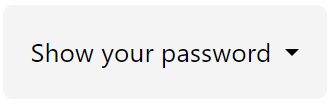

# Esercitazione

---

## Password Generator (insicuro)

---

### Testo dell' esercizio
Chiedi all’utente il suo nome,
poi chiedi il suo cognome,
poi chiedi il suo colore preferito
Infine scrivi sulla pagina nomecognomecolorepreferito21

---

### Algoritmo di svolgimento

**1. Raccolta dei dati** 
Chiederemo all' utente il suo nome, il suo cognome ed infine il suo colre preferito, uno per volta.

**2. Logica del programma**
Creazione di una password composta dalla concatenzaione dei 3 dati in input con il numero casuale finale "21".

**3. Output**
Visualizzaremo a schermo l' output dei dati elaborati sotto forma di messaggio di testo contenuto in un elemento HTML.

---

## Anteprima

---

